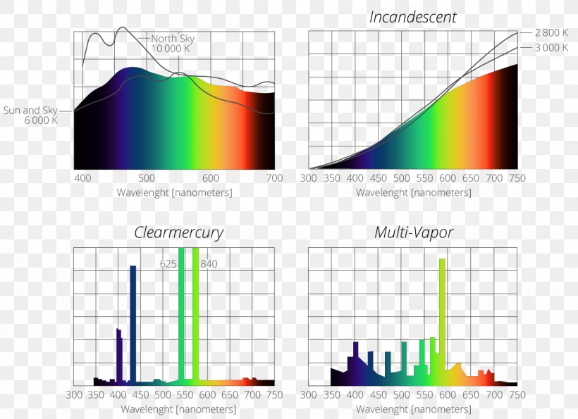
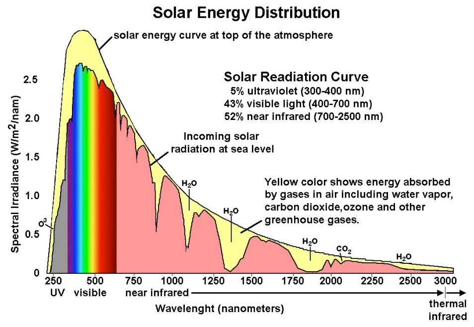
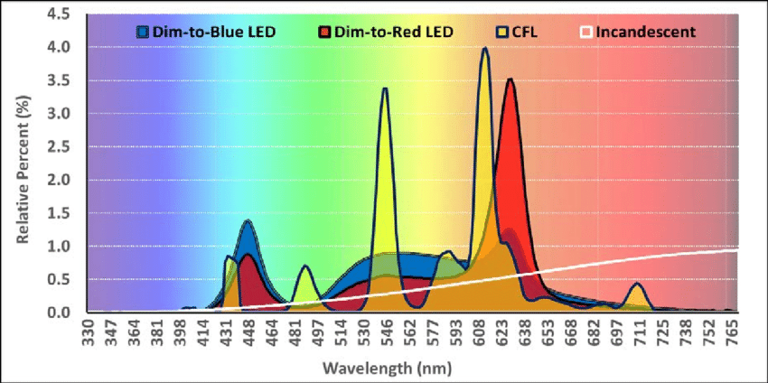
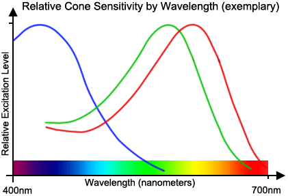
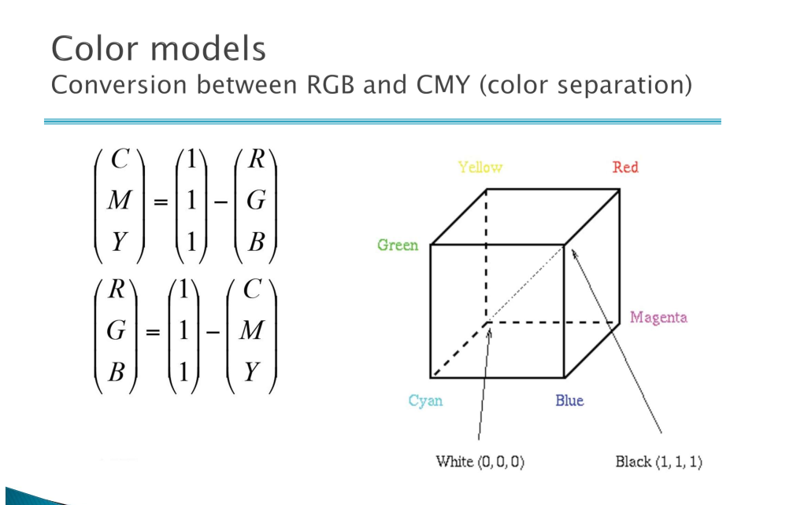
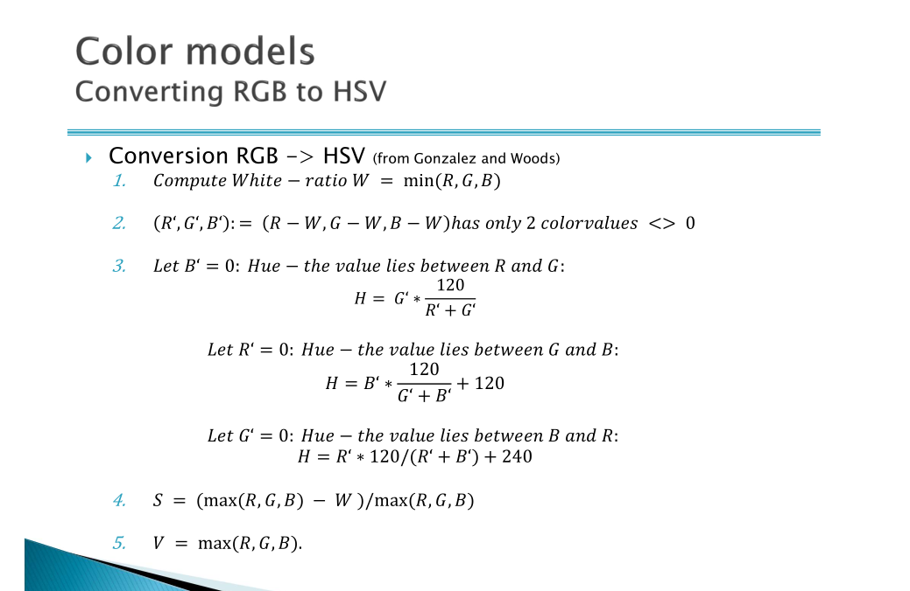

# TD 2

> 1st Mai 2023

## 1: color perception

1. roughly plot the Spectral Power Distribution for the following light sources: Daylight, incandescent bulb, mercury fluorescent bulb.

From Wikipedia: [Spectral Power Distribution](https://en.wikipedia.org/wiki/Spectral_power_distribution): "In [radiometry](https://en.wikipedia.org/wiki/Radiometry "Radiometry"), [photometry](https://en.wikipedia.org/wiki/Photometry_(optics)) "Photometry (optics)"), and [color science](https://en.wikipedia.org/wiki/Color_science "Color science"), a **spectral power distribution** ( **SPD** ) measurement describes the [power](https://en.wikipedia.org/wiki/Power_(physics)) "Power (physics)") per unit [area](https://en.wikipedia.org/wiki/Area "Area") per unit [wavelength](https://en.wikipedia.org/wiki/Wavelength "Wavelength") of an [illumination](https://en.wikipedia.org/wiki/Illumination_(lighting)) "Illumination (lighting)") ([radiant exitance](https://en.wikipedia.org/wiki/Radiant_exitance "Radiant exitance")). More generally, the term *spectral power distribution* can refer to the concentration, as a function of wavelength, of any radiometric or photometric quantity (e.g. [radiant energy](https://en.wikipedia.org/wiki/Radiant_energy "Radiant energy"), [radiant flux](https://en.wikipedia.org/wiki/Radiant_flux "Radiant flux"), [radiant intensity](https://en.wikipedia.org/wiki/Radiant_intensity "Radiant intensity"), [radiance](https://en.wikipedia.org/wiki/Radiance "Radiance"), [irradiance](https://en.wikipedia.org/wiki/Irradiance "Irradiance"), [radiant exitance](https://en.wikipedia.org/wiki/Radiant_exitance "Radiant exitance"), [radiosity](https://en.wikipedia.org/wiki/Radiosity_(heat_transfer)) "Radiosity (heat transfer)"), [luminance](https://en.wikipedia.org/wiki/Luminance "Luminance"), [luminous flux](https://en.wikipedia.org/wiki/Luminous_flux "Luminous flux"), [luminous intensity](https://en.wikipedia.org/wiki/Luminous_intensity "Luminous intensity"), [illuminance](https://en.wikipedia.org/wiki/Illuminance "Illuminance"), [luminous emittance](https://en.wikipedia.org/wiki/Luminous_emittance "Luminous emittance"))."

2. Plot a graph of the spectral sensitivities of the S, M and L cones  in the human eye. For each cone mark the wavelength of maximum absorption.

> short (S) wavelengths (blue), medium (M) wavelengths (green), and long (L) wavelengths (red).

L: 560 nm (red cone)

M: 530 nm (green cone)

S: 430 nm (blue cone)

3. What are Metamers?

Metamers are colors that appear to be identical or very similar to each other under certain lighting conditions, but have different spectral compositions. In other words, metamers are colors that look the same, but are actually composed of different wavelengths of light.

This can occur because the human eye perceives color based on the relative amounts of light that are absorbed or reflected by different wavelengths of light. So, two objects that reflect or emit different combinations of wavelengths of light can appear to be the same color if the relative amounts of light in each wavelength are the same.

For example, consider two light sources that emit light with different spectral compositions, but both of which stimulate the same set of color receptors in the human eye to the same extent. The light from these two sources will appear to be the same color, even though the spectral compositions are different. This phenomenon is known as metamerism.

4. A piece of paper when viewed under daylight or indoors under an incandescent bulb appears to be white in both cases, even though the irradiance differs (white light vs yellower light). Explain this phenomena.

This phenomenon can be explained by a concept called color constancy, which is a feature of human visual perception. Color constancy allows us to perceive the color of an object as relatively constant, despite changes in lighting conditions and the spectral composition of the light source.

In the case of a piece of paper appearing white under both daylight and incandescent light, this can be attributed to the way our visual system processes the information it receives from the environment. When we observe an object, our brain takes into account the surrounding context, including the light source and other objects in the scene. It then adjusts our perception of the object's color to maintain a consistent appearance.

Under daylight, the light source has a relatively balanced spectral composition, containing a wide range of wavelengths. This produces what we perceive as "white light." When a piece of paper is illuminated by daylight, it reflects all wavelengths of light fairly evenly, which we perceive as white.

Under an incandescent bulb, the light source has a warmer, yellower color, which means that it has a higher proportion of longer wavelengths (yellow and red) and a lower proportion of shorter wavelengths (blue and green). When the paper is illuminated by this light, it still reflects all wavelengths present, but the overall color of the light is shifted towards yellow.

However, our visual system takes into account the color of the light source, and it adjusts our perception of the paper's color accordingly. As a result, we still perceive the paper as white, even though the spectral composition of the light reflecting off the paper has changed. This adaptive processing by our brain ensures that we perceive the color of objects in a consistent manner, regardless of the lighting conditions.

## 2. Color models

1. What is a color model? Describe the main properties of the following color models: RGB, CMYK, HSV.

A color model is a mathematical representation that describes colors as tuples of numbers, typically within a specific coordinate system or color space. Color models provide a standardized way to define, represent, and manipulate colors in various applications, such as digital imaging, computer graphics, and color printing. By using a color model, we can consistently describe and reproduce colors across different devices and platforms.

There are several color models, each with a unique purpose and representation. Here are a few examples:

1. RGB (Red, Green, Blue) model:
   The RGB color model is an additive color model primarily used in electronic displays, such as computer monitors, TVs, and smartphones. In the RGB model, colors are formed by combining different intensities of red, green, and blue light. Each color channel can have a value ranging from 0 to 255 (8-bit representation), where (0, 0, 0) represents black and (255, 255, 255) represents white. Intermediate colors are formed by mixing different intensities of the primary colors. For example, (255, 0, 0) is pure red, (0, 255, 0) is pure green, and (0, 0, 255) is pure blue.
2. CMYK (Cyan, Magenta, Yellow, Key/Black) model:
   The CMYK color model is a subtractive color model predominantly used in color printing. In the CMYK model, colors are created by mixing different amounts of cyan, magenta, yellow, and black ink. Each color channel typically has a percentage value ranging from 0% to 100%, where (0%, 0%, 0%, 0%) represents white (no ink) and (0%, 0%, 0%, 100%) represents black. Intermediate colors are formed by mixing different percentages of the primary inks. For example, (100%, 0%, 0%, 0%) is pure cyan, (0%, 100%, 0%, 0%) is pure magenta, and (0%, 0%, 100%, 0%) is pure yellow.
3. HSL (Hue, Saturation, Lightness) and HSV/HSB (Hue, Saturation, Value/Brightness) models:
   The HSL and HSV/HSB color models are alternative representations of colors in a cylindrical-coordinate system, which are more intuitive for humans to understand and manipulate. Both models represent colors using hue (color type, e.g., red, green, blue), saturation (color intensity or purity), and either lightness (HSL) or value/brightness (HSV/HSB). These models are often used in color selection tools and image editing software, as they provide an intuitive way to pick and adjust colors based on human perception.
4. Can every color perceptible to the human eye be displayed as a combination of three primaries? Give evidence to support your answer.

The human eye can perceive a vast range of colors, thanks to the presence of three types of cone cells in the retina, each sensitive to different parts of the visible spectrum: short (S) wavelengths (blue), medium (M) wavelengths (green), and long (L) wavelengths (red). The trichromatic theory of color vision explains that our perception of color is based on the combined response of these three cone types to incoming light.

In most cases, a wide range of colors can be represented as a combination of three primary colors, such as red, green, and blue (RGB) in electronic displays or cyan, magenta, and yellow (CMY) in color printing. However, not all colors perceptible to the human eye can be accurately displayed using just three primary colors.

The CIE 1931 color space, also known as the CIE XYZ color space, was developed to quantify the range of colors perceivable by the human eye. It was based on a series of experiments that measured the color matching functions of human observers. The resulting color space encompasses all colors visible to the human eye, and its chromaticity diagram represents colors as points within a horseshoe-shaped region called the "spectral locus."

When using only three primary colors, we can create a color gamut that covers a specific subset of the CIE 1931 color space. The gamut is typically represented as a triangle connecting the chromaticity coordinates of the three primary colors. However, no triangle can cover the entire spectral locus, which means that there will always be some visible colors that cannot be accurately represented by a combination of three primaries.

In practical applications, devices like monitors, TVs, or printers have a limited color gamut that covers only a subset of the colors perceivable by the human eye. While these devices can produce a wide range of colors, they cannot reproduce every color visible to humans. Advances in display technology, such as wide color gamut (WCG) displays, aim to cover a larger portion of the CIE 1931 color space and reproduce more of the colors perceptible to the human eye, but there are still limitations.

4. Given a colour represented in RGB colour space as R= 0.2,G= 0.6,B= 0.3, what is its representation in the CMYK and HSV colour models?

R= 0.2, G=0.6, B=0.3

Conversion: RGB <-> CMY

So 

C = 1 - R = 1 - 0,2 = 0,8

M = 1 - G = 1 - 0,6 = 0,4

Y = 1 - B = 1 - 0,3 = 0,7

K = 0

Conversion: RGB <-> HSV

W = min(R, G, B) = 0.2

R' = R - W = 0.2 - 0.2 = 0

G' = G - W = 0.6 - 0.2 = 0.4

B' = B - W = 0.3 - 0.2 = 0.1

R' is 0 so the value lies between G and B.

H = B' * (120 / (G' + B')) + 120 = 0.1*(120/(0.4 + 0.1)) + 120 = 144

## 3: color spaces

1. What is the rationale behind the color difference?

When you change the video quality ratio, such as switching from 1024p to 240p, the colors may appear to change due to several factors related to compression, color depth, and display resolution. Here are some reasons why colors may look different at different video quality levels:

1. Compression: Video files are often compressed to reduce their size for more efficient storage and streaming. Higher-resolution videos, such as 1024p, have more data and details than lower-resolution videos, like 240p. When compressing a video, some of the color data and other details might be lost or approximated to save space, resulting in color changes or artifacts. Lower-resolution videos tend to have more compression artifacts, which can affect the appearance of colors.
2. Color depth: Color depth (also known as bit depth) refers to the number of bits used to represent the color of a single pixel in a digital image or video. Higher color depths can represent a broader range of colors, while lower color depths result in a more limited color palette. When video quality is reduced, color depth might also be reduced to save space, which can lead to visible changes in the colors displayed.
3. Display resolution: The display resolution of your screen also plays a role in how colors appear when changing video quality. Higher-resolution screens can display more detail and finer color gradations, whereas lower-resolution screens might not be able to display subtle color differences or fine details as accurately. When you change the video quality ratio, the video is resampled and resized to match the new resolution. This resampling process can result in color blending and loss of detail, which might affect the appearance of colors.
4. Scaling artifacts: When a video is scaled up or down to fit the display or match a specific quality ratio, it may introduce scaling artifacts. These artifacts occur because the scaling process involves interpolating pixel values to create new pixels, which can result in color blending, distortion, and other visual changes.

In summary, the perceived change in colors when changing video quality ratios is often a result of compression, color depth reduction, display resolution limitations, and scaling artifacts. These factors can affect the accurate representation of colors and overall image quality.

2. How does the CIE Lab color space differ from CIE XYZ?

The CIE Lab and CIE XYZ color spaces are both ways to represent colors mathematically, and they are both based on the color matching experiments conducted by the International Commission on Illumination (CIE). However, they serve different purposes and have different properties.

CIE XYZ:

- The CIE XYZ color space, introduced in 1931, is a tristimulus color space based on the human visual system's response to light. It is designed to encompass all colors perceivable by the average human observer.
- The XYZ color space is a linear color space, which means that the relationships between the coordinates in the color space correspond to the physical properties of light. This makes it useful for colorimetric calculations, but it does not correspond well to human perception of color differences.
- The chromaticity diagram derived from the CIE XYZ color space forms the basis for many other color spaces and helps in understanding the relationship between different colors and illuminants.

CIE Lab:

- The CIE Lab color space, introduced in 1976, is a color-opponent space designed to be perceptually uniform. This means that the distance between two points in the CIE Lab color space is intended to be proportional to the perceived color difference between those points.
- The Lab color space is non-linear and derived from the CIE XYZ color space using a transformation that involves the adaptation to a reference white point. This transformation ensures that the space is more perceptually uniform and better suited for applications where color differences are essential, such as color management, image editing, and color science.
- In the CIE Lab color space, the L* axis represents lightness, while the a* and b* axes represent the color opponent dimensions, with a* ranging from green to magenta and b* ranging from blue to yellow.

In summary, the CIE XYZ color space is a linear color space based on the human visual system's response to light, making it useful for colorimetric calculations. In contrast, the CIE Lab color space is a perceptually uniform color space designed to better represent human perception of color differences, making it well-suited for applications involving color management and comparison.
