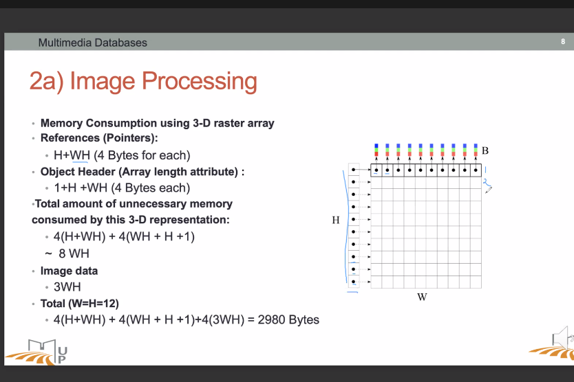
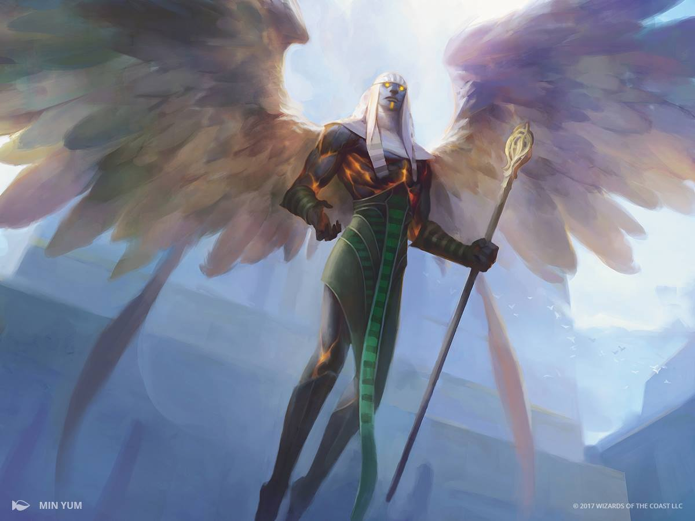

# Sheet 3 - Multimedia Databases

## 1 - Image Formats

1. Describe the differences between vectorial and raster (bitmap) image formats.

Vector and raster (or bitmap) are two different types of digital image formats. The main difference between them lies in how they store and represent images.

A raster image is made up of a grid of pixels, each pixel containing a specific color value. The resolution of a raster image is determined by the number of pixels it contains, with higher resolutions providing greater detail and clarity. Examples of raster image formats include JPEG, GIF, and PNG. Raster images are best suited for photographs or images with complex shading and color variations.

On the other hand, a vector image is composed of mathematical formulas that define the shape, size, and position of each object in the image. Vector images can be scaled up or down without losing quality or clarity, since the mathematical formulas can be recalculated to fit any size. Examples of vector image formats include SVG, AI, and EPS. Vector images are best suited for designs that require clean, crisp lines and shapes, such as logos, icons, and typography.

2. Outline the main properties of the following image formats: GIF, PNG and JPEG with
   respect to the following dimensions: color model, color depth, compression, file size.

Sure! Here's an outline of the main properties of GIF, PNG, and JPEG image formats in regards to color model, color depth, compression, and file size:

**GIF: **Graphics Interchange Format****

- Color model: Indexed color.
- Color depth: Up to 8 bits (256 colors). Wikipedia: "The format supports up to [8 bits per pixel](https://en.wikipedia.org/wiki/8-bit_color "8-bit color") for each image, allowing a single image to reference its own [palette](https://en.wikipedia.org/wiki/Palette_(computing)) "Palette (computing)") of up to 256 different colors chosen from the [24](https://en.wikipedia.org/wiki/24-bit_color "24-bit color")-bit [RGB color space](https://en.wikipedia.org/wiki/RGB_color_model "RGB color model")."
- Compression: Lossless compression algorithm that uses LZW (Lempel–Ziv–Welch) coding.
- File size: Relatively small file size compared to other formats due to its compression method. Best suited for images with limited color palettes or simple graphics such as logos, icons, or animations.

**PNG:**

- Color model: RGBA (Red Green Blue Alpha).
- Color depth: 24-bit (correction) or 32-bit (supports alpha channel for transparency).
- Compression: Lossless compression algorithm that uses deflate compression.
- File size: Larger than GIF files but smaller than uncompressed TIFF files. Best suited for images that require transparency or images with high color depth such as graphics or diagrams.

**JPEG:**

- Color model: RGB (Red Green Blue).
- Color depth: 24-bit (16 million colors).
- Compression: Lossy compression algorithm that uses discrete cosine transform (DCT).
- File size: Smaller than PNG files but larger than GIF files. Best suited for photographic images or images with complex color gradients that require high levels of compression.

Note that the specific properties of each format can vary based on the settings used during image creation, and some formats may support additional features beyond what's outlined here (e.g. PNG also supports interlacing and gamma correction).

## 2 - Image Processing and Resolution

Let I be an 12 x 12 RGB image.
a) Consider an RGB image implementation inJavathat stores pixels in a 3D array (of integers),
where each dimension corresponds to a color channel. How much memory is required to
store I?

In Java:

* `byte`: 8-bit signed two's complement integer (-128 to 127)
* `short`: 16-bit signed two's complement integer (-32,768 to 32,767)
* `int`: 32-bit signed two's complement integer (-2,147,483,648 to 2,147,483,647)
* `long`: 64-bit signed two's complement integer (-9,223,372,036,854,775,808 to 9,223,372,036,854,775,807)
* `float`: 32-bit IEEE 754 floating point (-3.4028235E38 to 3.4028235E38)
* `double`: 64-bit IEEE 754 floating point (-1.7976931348623157E308 to 1.7976931348623157E308)

~~So, we have 12x12x3x(int size) = `12*12*3*32` bits = 13824 bits, 1728 Bytes, ~1.7 KB~~

> Correction: Previous answer is WRONG. We have only computed the "useful" part of memory needed to store pixels. But we forgot to include the pointers needed for the internal representation.

Correction:

> NB: The 4(H+WH) is the number of pointers, and 4(WH+H+1) is the header for each list, added by the `memalloc` like operation.



b) One way to reduce memory consumption is to transform the 3D array representation into a
2D array representation. A pixel is packed into a single integer (32 bit), where each channel
is coded in 8 bits. The desired result is depicted in Figure 1. How much memory is saved
compared to the 3D array representation?

2D rep: 12x12x1x32 = 4608 bits, 576 Bytes, ~0.6 KB

3D: 1728 Bytes

We save 1728 - 576 = 1152 Bytes, ~ 1.1 KB

c) Describe how we can retrieve the individual R, G, B samples from the packed pixel.

To retrieve the individual R, G, B samples from a packed pixel in Java, you can use bit manipulation and masking operations.

Assuming that the 32-bit integer represents a single pixel with 8 bits for each of the red, green, blue, and alpha channels in ARGB format, here's an example of how you can extract the individual color components:

```java
int pixel = ...; // packed 32-bit ARGB pixel value
// & 0xFF means [0b, 0b, 0b, 1b] means we keep last byte of the int.
int alpha = (pixel >> 24) & 0xFF; // extract the alpha channel (here the masking is not really necessary)
int red = (pixel >> 16) & 0xFF; // extract the red channel
int green = (pixel >> 8) & 0xFF; // extract the green channel
int blue = pixel & 0xFF; // extract the blue channel
```

Here's how this code works:

1. We start with the 32-bit integer representing the packed pixel.
2. To extract the alpha channel, we shift the integer right by 24 bits using the `>>` operator, which moves the 8 bits representing the alpha channel to the rightmost position. Then, we apply a bit mask `0xFF` using the `&` operator, which sets all bits except the 8 rightmost bits to 0, effectively isolating the 8 bits representing the alpha channel.
3. To extract the red channel, we follow the same steps as before, but shift the integer right by 16 bits to move the 8 bits representing the red channel to the rightmost position.
4. To extract the green channel, we shift the integer right by 8 bits to move the 8 bits representing the green channel to the rightmost position.
5. To extract the blue channel, we apply the mask directly to the integer without shifting, since the blue channel is already in the rightmost position.

After executing this code, the variables `alpha`, `red`, `green`, and `blue` will contain the integer values of the corresponding color channels, in that order.

d) For an iPhone 11, given a screen size of 6.1 inches, aspect ratio of 19.5: 9, and resolution of
828 x 1792 pixels, calculate it’s pixel density (Show the steps).

**Pixel density**, also known as pixel pitch or dots per inch (DPI), refers to the number of pixels per unit of length in a display or image. It is typically expressed as the number of pixels per inch (PPI) or dots per inch (DPI), and is a measure of the resolution and image quality of a display or image.

For example, a display with a pixel density of 300 PPI means that there are 300 pixels per inch in both the horizontal and vertical directions. This means that the display can render a higher level of detail and sharpness compared to a display with a lower pixel density.

The **aspect ratio** of a screen is the ratio of its width to its height,
expressed as two numbers separated by a colon (e.g., 16:9 or 4:3). It is
a measure of the proportional relationship between the horizontal and
vertical dimensions of the screen.

Here, PPI: 6.1 is the diagonal

`(x*19.5)^2 + (x*9)^2 = (6.1)^2` using Pythagore triangle formula.

`x^2(19.5^2 + 9^2)  = (6.1)^2` using power distribution

`x^2 = 6.1^2 / (19.5^2 + 9^2)`

`x = sqrt(6.1^2 / (19.5^2 + 9^2) `

`x = 0.28402832027962843` from python: `math.sqrt((6.1 ** 2) / ((19.5 ** 2) + (9 ** 2)))`

Now we compute horizontal and vertical lenght

```shell
>>> width = x*19.5
>>> height = x*9
>>> width / height
2.1666666666666665
>>> 19.5 / 9
2.1666666666666665
>>> width
5.538552245452754
>>> height
2.556254882516656
```

width = 5.538552245452754 Inchs

height = 2.556254882516656 Inchs

> This means the screen size of a phone is considering the phone in landscape mode.
>
> In the correction, it's the opposite, but it doesn't really matter.

Formula for pixel density: `nb of pixels = size in inch * PPI`

So: `PPI = (nb of pixel) / (size in inch)`

PPI width = 1792 / 5.538552245452754 = 323.55025656231055

PPI height = 828 / 2.556254882516656 = 323.91136175936674

Now as a bonus, we compute PPI^2, wich is the number of pixel per inch square:

(828 x 1792) / (width * height) = `(828*1792) / (5.538552245452754*2.556254882516656) `

```python
>>> (828*1792) / (5.538552245452754*2.556254882516656)
104801.6042006905
>>> 324**2
104976
```

## 3: Quantization and Dithering

1. Write down the uniform and median cut color quantization algorithms (In simple steps,
   not code/pseudocode).
2.

#### Kmean

K-means is a popular unsupervised machine learning algorithm used for clustering, or grouping similar data points together. The goal of the algorithm is to partition a set of data points into `k` clusters, where each data point belongs to the cluster with the nearest mean or centroid.

The algorithm works as follows:

1. Initialize `k` centroids randomly from the data points.
2. Assign each data point to the nearest centroid (based on the Euclidean distance).
3. Recompute the centroids as the mean of all data points assigned to each cluster.
4. Repeat steps 2-3 until convergence (when the centroids no longer change significantly).


##### implementation in Python

```python
import numpy as np
from sklearn.cluster import KMeans

def quantize_uniform(image, n_colors):
    # Reshape the image into a 2D array of pixels
    pixels = np.reshape(image, (-1, 3))
  
    # Compute the K-means clustering on the pixels
    kmeans = KMeans(n_clusters=n_colors, random_state=0).fit(pixels)
    colors = kmeans.cluster_centers_.astype(int)
  
    # Replace each pixel with the closest cluster center
    labels = kmeans.predict(pixels)
    quantized = colors[labels]
  
    # Reshape the quantized image back into its original shape
    quantized = np.reshape(quantized, image.shape)
  
    return quantized
```

#### median cut

From [Wikipedia](https://en.wikipedia.org/wiki/Median_cut):

**Median cut** is an [algorithm to sort data](https://en.wikipedia.org/wiki/Sorting_algorithm "Sorting algorithm") of an arbitrary number of dimensions into series of sets by [recursively](https://en.wikipedia.org/wiki/Recursion "Recursion") cutting each set of data at the [median](https://en.wikipedia.org/wiki/Median "Median") point along the longest dimension. Median cut is typically used for [color quantization](https://en.wikipedia.org/wiki/Color_quantization "Color quantization"). For example, to reduce a 64k-colour image to 256 colours, median cut is used to find 256 colours that match the original data well.[[1]](https://en.wikipedia.org/wiki/Median_cut#cite_note-1)

##### Implementation of color quantization with median cut

Suppose we have an image with an arbitrary number of [pixels](https://en.wikipedia.org/wiki/Pixel "Pixel") and want to generate a [palette](https://en.wikipedia.org/wiki/Palette_(computing)) "Palette (computing)") of 16 colors. Put all the pixels of the image (that is, their [RGB values](https://en.wikipedia.org/wiki/RGB_color_model "RGB color model")) in a [bucket](https://en.wikipedia.org/wiki/Bucket_sort "Bucket sort"). Find out which color channel (red, green, or blue) among the pixels in the bucket has the greatest range, then sort the pixels according to that channel's values. For example, if the blue channel has the greatest range, then a pixel with an RGB value of **(32, 8, 16)** is less than a pixel with an RGB value of **(1, 2, 24)**, because **16 < 24**. After the bucket has been sorted, move the upper half of the pixels into a new bucket. (It is this step that gives the median cut algorithm its name; the buckets are divided into two at the [median](https://en.wikipedia.org/wiki/Median "Median") of the list of pixels.) This process can be repeated to further subdivide the set of pixels: choose a bucket to divide (e.g., the bucket with the greatest range in any color channel) and divide it into two. After the desired number of buckets have been produced, average the pixels in each bucket to get the final color palette.

##### implementation in Python

See `main.py`

Examples:




2. Give a brief explanation of noise dithering.

Noise dithering is a technique used to reduce the visual artifacts that occur when reducing the color depth of an image. When the number of colors in an image is reduced, the image may lose detail and appear blocky or pixelated.

Dithering introduces small amounts of random noise to the image to simulate the appearance of additional colors and smooth out the transitions between colors. This can create the illusion of a larger color palette and a higher level of detail in the image, even though the actual number of colors remains the same.

The basic idea of noise dithering is to add a random value to each pixel in the image before reducing the color depth. The random value is typically chosen from a small fixed pattern or a random distribution, such as Gaussian noise. The added noise creates the appearance of intermediate colors, which helps to smooth out the color transitions in the reduced-color image.

There are many variations of noise dithering, such as ordered dithering, error diffusion, and blue noise dithering. Each variation uses a different method for selecting the random values and distributing the error across the image.

Overall, noise dithering is a simple and effective technique for improving the visual quality of images with reduced color depth. It is commonly used in applications such as image compression, web graphics, and digital printing.

Example with dithering:


