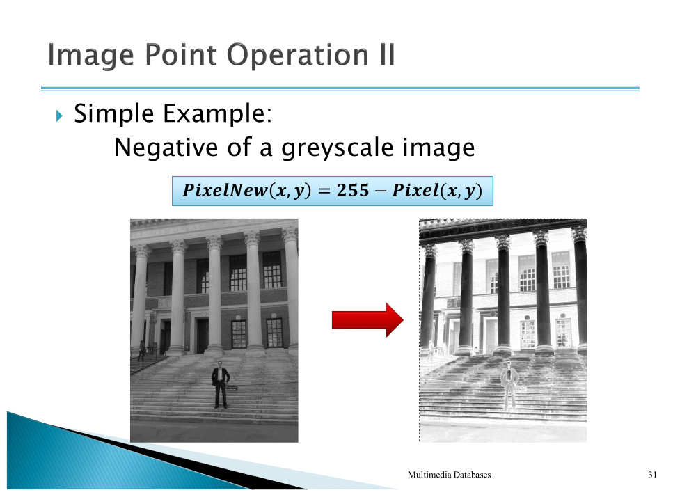
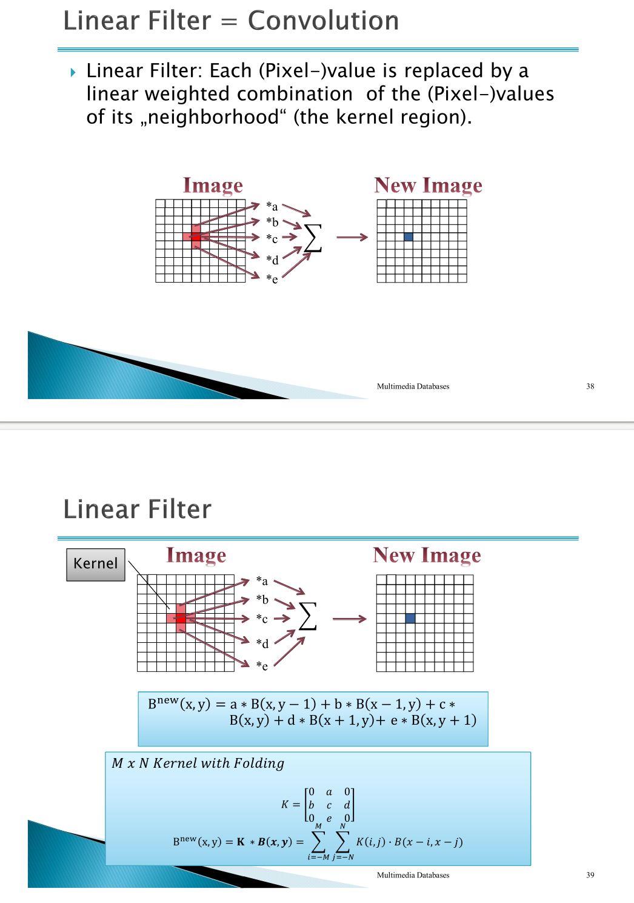
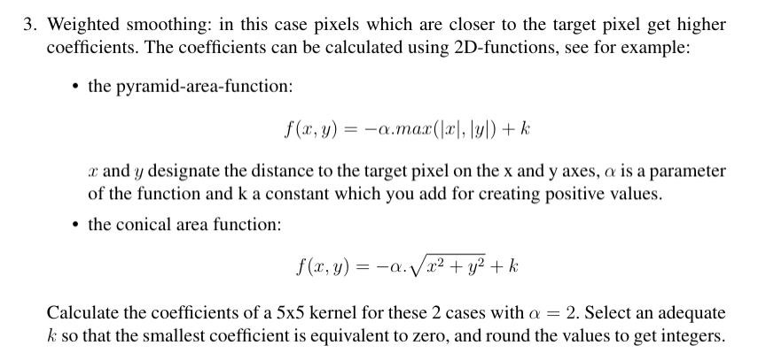
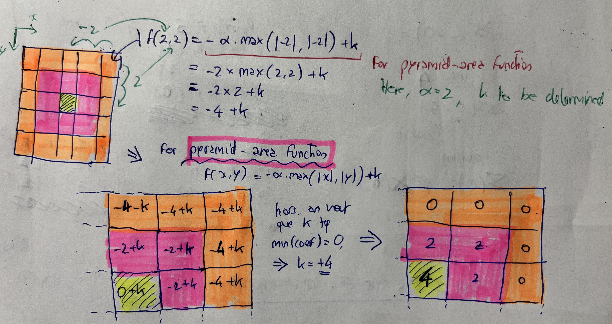
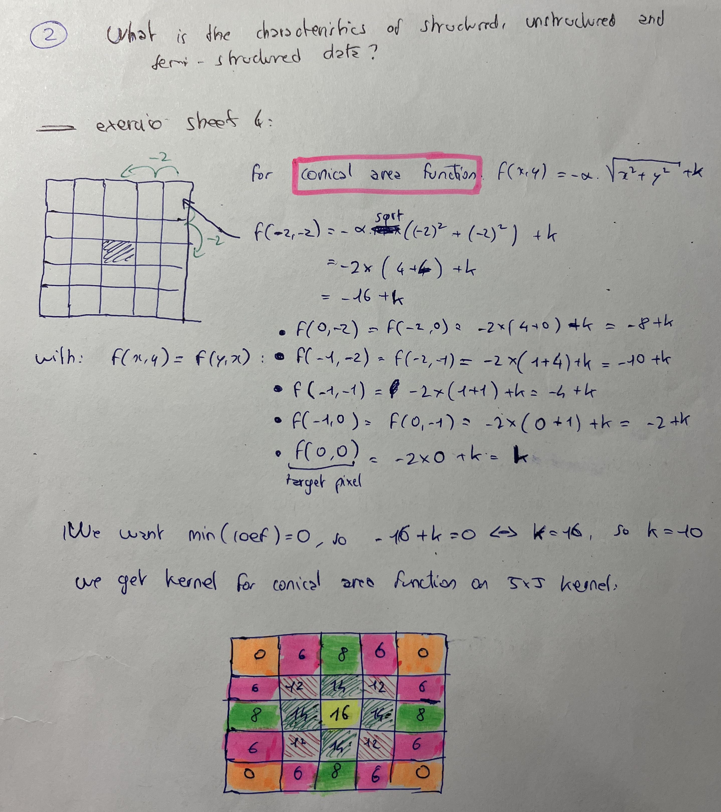
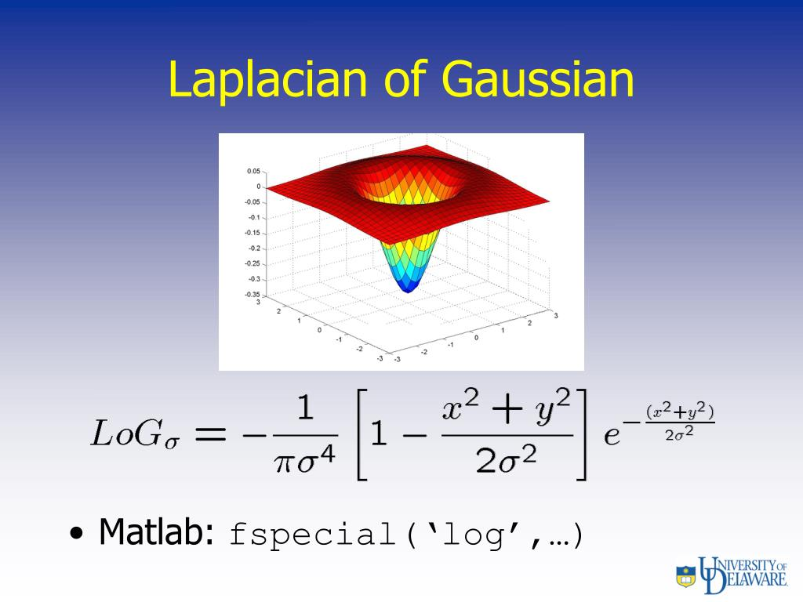

# Image Processing Part 2

## 1: Point operation

In the field of image processing, we assume that we are using an 8-Bits grayscale image. The HK point operation is defined as follows: ``p_output = (alpha * p_input)+ beta``, where `p_input` and `p_output` are pixel values of the input and output image respectively.

> Q?: What does HK means ??? -> "Helligkeit und Kontrast" (in german)

1. How do the parameters `alpha` and `beta` influence the result of the operation?

In the field of image processing, the operation you've described is a form of linear point operation or linear transformation. This operation is applied to each pixel in the image individually. Here's how the parameters `alpha` and `beta` influence the result:

Short answer:

* `alpha`: gain, contrast factor
* `beta`: bias, brightness factor

Long answer:

- `alpha`: This parameter is a scaling factor. It determines the contrast of the output image. If `alpha` is greater than 1, the contrast of the image will increase. If `alpha` is less than 1 but greater than 0, the contrast of the image will decrease. If `alpha` is equal to 1, the contrast of the image will remain the same. If `alpha` is negative, the image will be inverted and the contrast may also change.
- `beta`: This parameter is an offset or bias. It shifts the intensity values of the image. If `beta` is positive, the image will become brighter, as all pixel values are increased. If `beta` is negative, the image will become darker, as all pixel values are decreased. If `beta` is zero, the brightness of the image will remain the same.

It's important to note that these operations can cause pixel values to go outside the valid range for an 8-bit grayscale image (0-255). If this happens, the values will typically be clipped to the valid range, which can cause loss of detail in the image.

2. Explain which HK operation could be applied to implement the image inversion function.



Image inversion, also known as negative transformation, is a point operation that inverts the grayscale values of an image. This operation is particularly useful for enhancing white or gray detail embedded in dark regions of an image, especially when the black and white levels are displayed as white and black, respectively.

In the context of an 8-bit grayscale image, where pixel intensity values range from 0 (black) to 255 (white), the inversion operation can be implemented using the following formula:

``p_output = 255 - p_input``

In this formula, `p_input` is the original pixel value, and `p_output` is the pixel value after the inversion operation.

This operation subtracts each pixel's intensity value from the maximum possible value (255 for an 8-bit image). As a result, low-intensity (dark) pixels become high-intensity (light), and high-intensity (light) pixels become low-intensity (dark), effectively inverting the image.

In terms of the HK operation from previous question, this corresponds to `alpha = -1` and `beta = 255`.

3. Which problems could appear, if HK is used with unadapted α and β parameters? Pro-
   pose a method to deal with these effects.

When using the HK operation in image processing, if the parameters `alpha` and `beta` are not properly chosen, several issues can arise:

1. **Clipping**: If the result of the operation `(alpha * p_input) + beta` falls outside the valid range for pixel values (0-255 for an 8-bit image), the value will be clipped to the nearest valid value. This can lead to loss of detail in the image, particularly in the highlights or shadows.
2. **Contrast degradation**: If `alpha` is set to a value less than 1, the contrast of the image will decrease. This can make the image appear flat or washed out.
3. **Image inversion**: If `alpha` is negative, the image will be inverted. This may not be a problem if image inversion is the desired effect, but it could be unexpected if not.
4. **Brightness shift**: If `beta` is set to a value other than 0, the brightness of the image will change. A positive `beta` will make the image brighter, while a negative `beta` will make the image darker. This can lead to overexposure or underexposure if not controlled properly.

To deal with these effects, one could implement a few strategies:

- **Range checking and normalization**: After applying the HK operation, check if the new pixel values fall outside the valid range. If they do, normalize the values to bring them back into the valid range. This can help prevent clipping.
- **Adaptive parameter selection**: Choose `alpha` and `beta` based on the characteristics of the specific image. For example, if the image is very dark, you might choose a larger `alpha` to increase contrast and a positive `beta` to increase brightness.
- **Histogram equalization**: This is a method that can improve the contrast in an image. It works by effectively spreading out the most frequent intensity values in an image, making it a useful tool for images with backgrounds and foregrounds that are both bright or both dark.

Remember, the best method to deal with these effects will depend on the specific image and the desired outcome of the image processing operation.

4. Let G be a grayscale image with minimum pixel value a and maximum pixel value b. Which HK Operation could be applied to G in order to maximize its contrast ratio?

To maximize the contrast ratio of a grayscale image, you would want to stretch the range of pixel values to span the full range of the grayscale. This is often referred to as contrast stretching or normalization.

In the context of the HK operation, you can achieve this by choosing appropriate `alpha` and `beta` values. The operation would look like this:

``p_output = alpha * (p_input - a) + 0``

Here, `alpha` is a scaling factor that is equal to `255 / (b - a)`, and `p_input` is the original pixel value. This operation subtracts the minimum pixel value `a` from each pixel, scales the result so that the maximum pixel value maps to 255, and leaves the minimum pixel value at 0.

In other words, the operation transforms the range `[a, b]` to `[0, 255]`, maximizing the contrast ratio of the image.

Please note that this operation assumes that the input image has some variation in pixel values. If `a` is equal to `b` (i.e., all pixels have the same value), then the operation is undefined because you would be dividing by zero when calculating `alpha`. In such a case, the image has no contrast to begin with, and no operation can increase it.

## 2: Linear filter



Figure above describes the region processing operation called (convolution). The application of the operation on all pixels of an image defines a linear filter.

Convolution is a fundamental operation in image processing that involves applying a filter or kernel to an image. This is an **abstraction** for the context surrounding a piece of information. This operation is performed by sliding the kernel over the image and computing the sum of the products between the corresponding elements of the image and the kernel.

However, applying convolution to an image can lead to issues, especially at the edges of the image. Here are some problems that can occur:

1. **Undefined values**: Since the kernel needs to be centered on a pixel to compute the convolution, for edge pixels, part of the kernel will fall outside the image. This leads to undefined values.
2. **Edge effects**: Even if we define values for the edge pixels, the operation can lead to artifacts at the edges of the image. This is because the edge pixels are processed differently from the rest of the image.
3. **Loss of image size**: After convolution, the output image may be smaller than the input image, depending on how the edge pixels are handled. This is because the convolution operation is only defined when the kernel can be centered on a pixel.

Here are some common approaches to deal with these problems:

1. **Padding**: Add extra pixels around the edge of the image. The values of these pixels can be set to zero (zero padding), to the value of the nearest image pixel (edge value padding), or by wrapping around the values from the opposite edge of the image (wrap around padding).
2. **Extension**: Extend the image values beyond the edges. This can be done by mirroring the image at the edges, or by extending the nearest pixel value outwards.
3. **Normalization**: Normalize the kernel so that the sum of its elements is 1. This ensures that the overall brightness of the image is preserved.
4. **Ignore the edge pixels**: Simply leave the edge pixels unprocessed. This will result in a smaller output image, but it avoids the issue of edge effects.

Each of these methods has its own advantages and disadvantages, and the best choice depends on the specific application and requirements.

2. A smoothing filter can be implemented using a linear (convolution) filter and a well-
   chosen kernel. For this purpose calculate a 5x5 kernel for the ’moving average’ variant of
   the smoothing filter, in which a pixel is replaced by the average values of its neighbours.

The 'moving average' variant of the smoothing filter, also known as a mean filter or box filter, is a simple and commonly used method for smoothing an image. This filter works by replacing each pixel in the image with the average value of its neighboring pixels, including itself.

The kernel for a moving average filter is typically a square matrix filled with ones. The size of the kernel determines the number of neighboring pixels to consider when calculating the average. In the case of a 5x5 kernel, it would consider the 24 neighboring pixels plus the pixel itself.

Here's an example of a 5x5 moving average kernel:

```
1/25 1/25 1/25 1/25 1/25
1/25 1/25 1/25 1/25 1/25
1/25 1/25 1/25 1/25 1/25
1/25 1/25 1/25 1/25 1/25
1/25 1/25 1/25 1/25 1/25
```

Each element in the kernel is equal to 1 divided by the total number of elements in the kernel (in this case, 25), so that the sum of all elements is 1. This ensures that the overall brightness of the image is preserved after the filter is applied.

When this kernel is convolved with the image, each pixel in the output image is set to the average of the corresponding pixel and its neighbors in the input image. This has the effect of reducing noise and smoothing out variations in the image.

As with any convolution operation, care must be taken when applying the moving average filter to the edges of the image. This is because the kernel needs to be centered on a pixel to compute the convolution, and for edge pixels, part of the kernel will fall outside the image. This can be handled using various methods such as padding, extension, or ignoring the edge pixels.

3. Weighted smoothing: in this case pixels which are closer to the target pixel get higher
   coefficients. Calculate the coefficients of a 5x5 kernel for these 2 cases with α = 2. Select an adequate k so that the smallest coefficient is equivalent to zero, and round the values to get integers.



My answers below:



> WARN: I forgot to compute the square roots in the following answer!



4. Why are laplacian filters used? Give an example.



Laplacian filters are used in image processing for edge detection. Edge detection is a fundamental tool in image processing, computer vision and machine learning, as it locates areas in an image where significant changes in intensity occur, which typically correspond to object boundaries.

The Laplacian filter is a second order derivative filter that calculates the second derivative of the image intensity at each pixel, which corresponds to the rate of change of the gradient or the edge strength. The result is a map of the edges, as edges correspond to rapid changes in intensity.

The Laplacian filter is sensitive to noise, as noise can cause rapid changes in intensity. Therefore, it is common to smooth the image with a Gaussian filter before applying the Laplacian filter. This combination is known as the Laplacian of Gaussian (LoG) filter.

Here's an example of a simple 3x3 Laplacian filter:

```
0  -1  0
-1  4 -1
0  -1  0
```

This filter calculates the difference between a pixel and its four neighbors (up, down, left, right). If the pixel is on an edge, this difference will be large, and the pixel in the output image will be bright. If the pixel is not on an edge, the difference will be small, and the pixel in the output image will be dark.

Note that there are other versions of the Laplacian filter that also consider the diagonal neighbors, and the specific filter used can depend on the specific requirements of the application.
