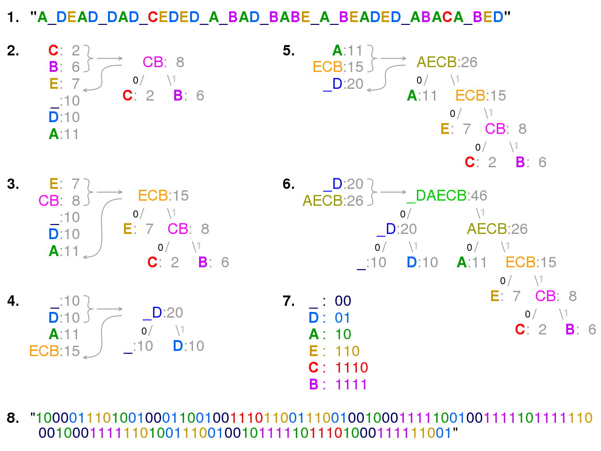

# Exercise sheet 6

1. LZW Compression

The Lempel-Ziv-Welch (LZW) compression algorithm is a lossless data compression algorithm that was developed by Abraham Lempel, Jacob Ziv, and Terry Welch. It is a dictionary-based compression algorithm that is used in a variety of applications, including file compression, GIF image files, and in modems for data transmission.

**History**

The LZW algorithm was developed in 1984 by Terry Welch as an improvement on the LZ78 algorithm, which was developed by Abraham Lempel and Jacob Ziv in 1978. The LZ78 algorithm itself was an improvement on the LZ77 algorithm, which was also developed by Lempel and Ziv in 1977. These algorithms are all part of the LZ family of compression algorithms, which are based on the principle of replacing repeated occurrences of data with references to a single copy.

**How It Works**

The LZW algorithm works by creating a dictionary of strings that are encountered in the input data. When a string is encountered that is already in the dictionary, it is replaced with a code that represents the string in the dictionary. If a string is encountered that is not in the dictionary, it is added to the dictionary and the process continues. This results in a compressed output that consists of a sequence of codes that represent the original data.

**Use Cases**

The LZW algorithm is used in a variety of applications. It is used in the GIF file format for compressing images. It is also used in the UNIX compress command for file compression, and in modems for data transmission. The algorithm is also used in some implementations of the TIFF image format, and in the V.42bis modem standard.

**Limitations**

While the LZW algorithm is efficient and widely used, it does have some limitations. One of the main limitations is that it can result in expansion instead of compression for small or highly random data sets. This is because the algorithm adds every new string it encounters to the dictionary, which can result in a larger output if the input data is not repetitive.

Another limitation is related to the size of the dictionary. If the dictionary becomes too large, it can exceed the available memory, which can cause problems. Some implementations of the LZW algorithm address this issue by limiting the size of the dictionary and clearing it when it becomes full.

Finally, the LZW algorithm was subject to patent restrictions, which limited its use in some applications. The patents have since expired, but this was a significant issue in the past.

Despite these limitations, the LZW algorithm remains a popular and effective method for lossless data compression.

2. Huffman coding

Wikipedia: **Huffman code** is a particular type of optimal [prefix code](https://en.wikipedia.org/wiki/Prefix_code "Prefix code") that is commonly used for [lossless data compression](https://en.wikipedia.org/wiki/Lossless_data_compression "Lossless data compression").

Everything is well explained by the following image. Step 1 is the provided input string, step 2 is the counting of occurence of every characters in the step 1. Step 2 combines the 2 least occuring symbols and the sum of join symbols, next steps just perform the same till there is only one big symbol left. Step 7 just shows the result of the encoding (all left edges are 0s, and right edges are 1s in final tree).

