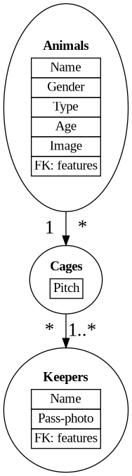

# Exercise sheet 8

### Aufgabe 1: Difference between relational and object-relational databases

**Outline the main differences between relational and object-relational database systems. Explain in particular the complexity of the used data structures, their indexing, the request predicates and the advantages and disadvantages of each type of system.**

Relational Database Systems (RDBMS) and Object-Relational Database Systems (ORDBMS) are two types of data management systems, each with their own unique characteristics, advantages, and disadvantages.

1. **Data Structures**

   - RDBMS: Uses tables to store data. Each table has a fixed schema defined by columns (fields) and rows (records). The structure is simple and consistent, which makes it easy to understand and use.
   - ORDBMS: Extends the traditional table structure by allowing complex data types, such as arrays, multimedia data, geospatial data, etc. It integrates the object-oriented programming paradigm, meaning it can store objects directly in the database. This allows for more complex and varied data structures.
2. **Indexing**

   - RDBMS: Indexing in a relational database is typically done on specific columns to speed up data retrieval. Primary key or unique indexes, as well as non-unique indexes, can be defined.
   - ORDBMS: In addition to the indexing capabilities of RDBMS, ORDBMS can also provide indexing on the complex data types it supports, such as spatial or multimedia data. This can improve performance for queries involving these types of data.
3. **Request Predicates (Querying)**

   - RDBMS: Uses Structured Query Language (SQL) for defining and manipulating data. SQL is a declarative language that allows users to specify what they want without detailing how to do it.
   - ORDBMS: Also uses SQL, but extends it with object-oriented features. This might include support for encapsulation, inheritance, and polymorphism. Object-relational SQL allows for more complex queries and operations.
4. **Advantages**

   - RDBMS: Simplicity of its tabular structure, widespread usage and support, mature technology with robust tools, efficient for simple and structured types of data.
   - ORDBMS: Ability to handle complex data types and relationships, integration with object-oriented programming languages, potential for better performance for certain types of queries.
5. **Disadvantages**

   - RDBMS: Difficulty handling complex, unstructured data. May require significant data manipulation or 'flattening' of data to fit the tabular structure.
   - ORDBMS: Increased complexity, less mature with fewer tools and resources available. Can be overkill for simple, structured data.

In summary, RDBMS is a great option when you have structured, tabular data and you want a simple, reliable solution. ORDBMS can be a better choice when your data is complex or when your application uses an object-oriented programming language and you want to take advantage of the related benefits.

### Aufgabe 2: Definitions

The concepts mentioned are primarily related to Object-Relational Database Management Systems (ORDBMS).

An ORDBMS is a hybrid solution that attempts to combine the **simplicity and speed** of relational databases with the **flexibility** of object databases. In an ORDBMS, data can be stored in a traditional tabular manner (like in RDBMS) or as complex objects defined by user-defined types. This provides a higher degree of compatibility with object-oriented programming languages and can make certain operations more intuitive and efficient.

Here's a brief mapping of these concepts:

* **User-defined data type, Inheritance, Polymorphism, OID, and Collections** : These are concepts from object-oriented programming that ORDBMSs have incorporated. They allow for more complex and flexible data structures than what's possible in a purely relational system.
* **Table of objects** : This is a concept that specifically comes from the "relational" part of ORDBMS. It's a way of mapping object-oriented data structures to a relational format.
* **Relations between user-defined data types (1:n, 1:1)** : This is a concept from relational databases that also applies to ORDBMSs. It's about how different data types (or tables, in a more traditional RDBMS) can be related to each other.
* **REF and DEREF** : These are mechanisms for handling references to objects within an ORDBMS, similar to pointers in many programming languages.
* **Dot-operator** : This is a common way in many programming languages, and thus also in ORDBMSs, to access attributes or methods of an object.

These concepts are part of what makes ORDBMSs a powerful and flexible solution for managing complex data. They provide the benefits of both relational and object-oriented databases, while also overcoming some of the limitations of each.

Below are more details about definitions of many ORDBMS concepts:

1. **User-defined data type** : In object-relational databases, a user-defined data type (UDT) allows you to define your own data types which can include multiple data fields and methods that operate on those fields. For example, you might define a UDT `PERSON_TYPE` that includes fields for `first_name`, `last_name`, and `date_of_birth`, and methods to calculate the person's age.
2. **Inheritance** : This is a concept from object-oriented programming where one class (child) can inherit the properties and methods of another class (parent). In an object-relational context, this could mean that a table or UDT `EMPLOYEE_TYPE` that inherits from `PERSON_TYPE` would automatically include the `first_name`, `last_name`, and `date_of_birth` fields, in addition to any fields specific to employees.
3. **Table of objects** : A table of objects is a table where each row represents an instance of a specific UDT. The columns correspond to the attributes of the UDT. For example, a table `PERSON_TABLE` of `PERSON_TYPE` objects might have columns for `first_name`, `last_name`, and `date_of_birth`.
4. **Polymorphism** : Polymorphism is another concept from object-oriented programming, and it refers to the ability of different objects to respond, each in its own way, to the same function or method call. In an object-relational database, a method defined on a UDT can behave differently depending on the specific type or subtype of the object it's called on.
5. **OID (Object ID)** : An OID, or object identifier, is a unique identifier assigned to each object in an object-relational database. This can be used to reference specific objects, similarly to a primary key in a relational database.
6. **Relations between user-defined data types (1:n, 1:1)** : Just as tables in a relational database can have relationships (one-to-one, one-to-many, etc.), so can UDTs in an object-relational database. For example, a `PERSON_TYPE` object might have a one-to-many relationship with `BOOK_TYPE` objects if each person can own multiple books.
7. **REF and DEREF** : `REF` is a reference to an object instance, similar to a pointer in programming. `DEREF` is the process of accessing the object that a `REF` points to. For example, if `PERSON_REF` is a `REF` to a `PERSON_TYPE` object, you could use `DEREF(PERSON_REF)` to access the actual `PERSON_TYPE` object.
8. **Collections** : In the context of object-relational databases, collections can refer to nested tables or arrays within a UDT. For example, a `PERSON_TYPE` might include a nested table of `BOOK_TYPE` objects to represent all the books a person owns.
9. **Dot-operator** : The dot-operator is used to access the attributes or methods of an object. For example, if `john` is a `PERSON_TYPE` object, you could use `john.first_name` to access John's first name.

### Aufgabe 3: Content-based Image Search Using SQL/MM

The goal of this exercise is to develop a DB-application to manage a zoo. The DB must include information about animals, keepers and cages. Animals are characterized by a Name, Gender, Type, Age and an image. Keepers are are characterized by a Name and a Pass-photo. Cages are
assigned a pitch, and at least 1 keeper. The application offers the possibility to search for animals, based on SQL/MM features.

1. Sketch the entity–relationship model (ER model) for the given DB. The tables and relationships are generated using [Graphviz](https://www.digitalocean.com/community/tutorials/how-to-create-diagrams-in-python-with-diagram-as-code#step-1-mdash-installing-graphviz) in a Python script.

Generated by a Python script:



2. Write object-relational SQL statements to create the DB.

```sql
-- Create type for Animal
CREATE TYPE Animal AS (
    Name VARCHAR(100),
    Gender CHAR(1),
    Type VARCHAR(100),
    Age INT,
    Image BLOB
);

-- Create type for Keeper
CREATE TYPE Keeper AS (
    Name VARCHAR(100),
    Pass_photo BLOB
);

-- Create table for Animals
CREATE TABLE Animals OF Animal;

-- Create table for Keepers
CREATE TABLE Keepers OF Keeper;

-- Create table for Cages with foreign keys referencing Animals and Keepers
CREATE TABLE Cages (
    Pitch INT,
    Animal REF Animal SCOPE Animals,
    Keeper REF Keeper SCOPE Keepers
);

```

This script creates two user-defined types, `Animal` and `Keeper`, with appropriate fields. It then creates two tables of these types, `Animals` and `Keepers`. Finally, it creates a `Cages` table with a `Pitch` attribute and two `REF` attributes that reference an `Animal` and a `Keeper` respectively.

Please note that the actual SQL statements might vary slightly depending on the specific object-relational DBMS you're using. For instance, the `BLOB` data type used for `Image` and `Pass_photo` might need to be replaced by another data type suitable for storing images, depending on your DBMS.

Also, remember that this is a simplified example. In a real application, you would likely want to add constraints, keys, and other details to ensure data integrity and support your application's requirements.

3. Write SQL/MM queries to content-based search for animals. (Query-by-Example).

Example: SQL query to select all animals whose keeper's name is "Bob".

```sql
SELECT a.*
FROM Animals a, Cages c, Keepers k
WHERE DEREF(c.Animal) = a
AND DEREF(c.Keeper) = k
AND k.Name = 'Bob';
```

### Aufgabe 4: MPEG Query Format (MPQF)

The MPEG-7 standard provides a rich set of descriptions for multimedia content, including visual, audio, and structural descriptions. The MPEG-7 standard does not define a specific query language, but it does provide a data model that can be used with a variety of query languages.

One such language is the Multimedia Property Query Format (MPQF), which is used to express queries on properties of multimedia data. Using MPQF, you can specify the criteria for a query as well as the relative importance of each criterion.

Here's an example of what your query might look like in MPQF:

```xml
<MPQFQuery>
    <Semantic>
        <TextProperty weight="0.2">
            <Title> Berlin </Title>
        </TextProperty>
    </Semantic>
    <Visual>
        <ImageProperty weight="0.6">
            <Example> [Example Image Data] </Example>
        </ImageProperty>
        <SizeProperty weight="0.2">
            <MaxSize> 2048 </MaxSize>
        </ImageProperty>
    </Visual>
</MPQFQuery>
```

This query works as follows:

- The `Semantic` element contains a `TextProperty` element that searches for images with the title 'Berlin'. This criterion is given a weight of 0.2, indicating it is less important than the similarity criterion.
- The `Visual` element contains an `ImageProperty` element that searches for images similar to the example image. This is the most important criterion, with a weight of 0.6.
- The `Visual` element also contains a `SizeProperty` element that restricts the search to images no larger than 2048K. This criterion has a weight of 0.2.

Note that the actual data for the example image would need to be inserted where `[Example Image Data]` is. The specifics of how to encode this data will depend on your system's implementation of the MPEG-7 standard.

Finally, note that this query would need to be processed by a system that understands MPQF and the MPEG-7 data model. Such a system would likely provide a software interface for creating and executing these queries, rather than having users write them by hand.

2. Search for images, which have in their northern part a house and their southern part a tree. Furthermore, the images must obey the following dominant color distribution (Red 30%, Green 50% and Blue 20%). The search must return only JEPG images, and 30 at the maximum. Results must sorted by the title, similarity reference, and the file size.

Here's an example of what the query might look like in MPQF:

```xml
<MPQFQuery>
    <Semantic>
        <TextProperty weight="0.2">
            <Title/>
        </TextProperty>
        <RegionProperty weight="0.4">
            <NorthernPart> House </NorthernPart>
            <SouthernPart> Tree </SouthernPart>
        </RegionProperty>
    </Semantic>
    <Visual>
        <ImageProperty weight="0.6">
            <Format> JPEG </Format>
            <MaxResults> 30 </MaxResults>
        </ImageProperty>
        <ColorDistributionProperty weight="0.6">
            <Red> 30 </Red>
            <Green> 50 </Green>
            <Blue> 20 </Blue>
        </ColorDistributionProperty>
    </Visual>
    <SortBy>
        <Criteria> Title </Criteria>
        <Criteria> Similarity </Criteria>
        <Criteria> FileSize </Criteria>
    </SortBy>
</MPQFQuery>
```

This query works as follows:

- The `Semantic` element contains a `TextProperty` element that searches for images sorted by the title. This criterion is given a weight of 0.2.
- The `Semantic` element also contains a `RegionProperty` element that specifies the regions of the image. This criterion is given a weight of 0.4, indicating it is less important than the color distribution criterion.
- The `Visual` element contains an `ImageProperty` element that specifies the image format and the maximum number of results. This criterion is given a weight of 0.6.
- The `Visual` element also contains a `ColorDistributionProperty` element that specifies the dominant color distribution. This is the most important criterion, with a weight of 0.6.
- The `SortBy` element specifies the order in which the results should be sorted.

Note that this query would need to be processed by a system that understands MPQF and the MPEG-7 data model. Such a system would likely provide a software interface for creating and executing these queries, rather than having users write them by hand.

Also, the weights for each criterion in this query are arbitrary and can be adjusted based on your specific requirements. The weights should add up to 1, but the MPQF specification doesn't enforce this requirement.
